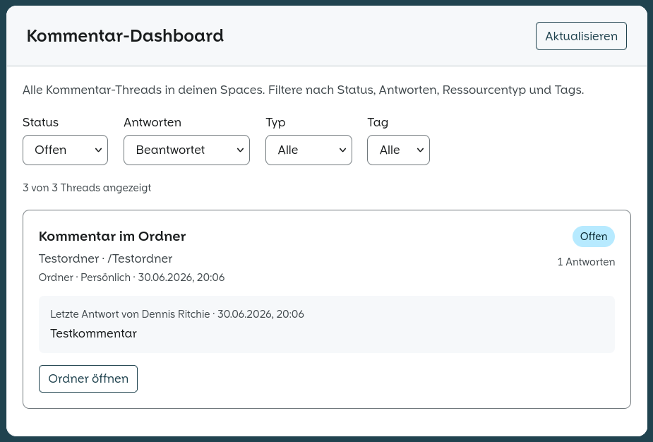
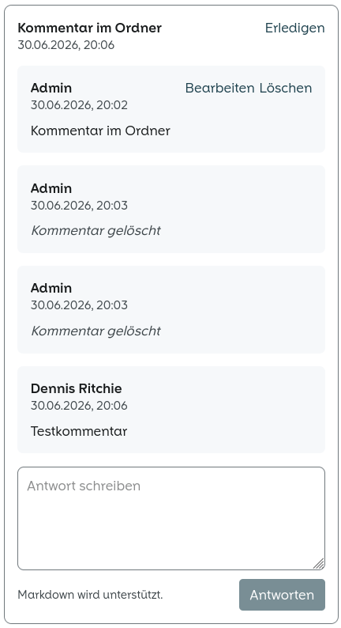

# Comments for OpenCloud

OpenCloud web extension for discussing files, folders, and spaces. Adds a **sidebar panel** in the Files app and a **comment dashboard** that aggregates threads across all spaces.

Comments are stored as WebDAV sidecar files next to each resource (`.{name}.jsco`) — no native comments API required. The storage layer is abstracted so a future backend can replace it without rewriting the UI.

| | |
|---|---|
| **App ID** | `comments` |
| **License** | AGPL-3.0 |
| **OpenCloud** | 7.x (extension-sdk 7.1.2) |
| **Languages** | English, German |

## Screenshots

### Comment dashboard

Filter threads by status, replies, resource type, and tags across all spaces.



### Sidebar panel

Discuss a selected file or folder directly from the Files app sidebar.



## Features

### Sidebar panel

- Comment on a selected file or folder from the Files app sidebar
- Markdown support for comment bodies
- Thread replies, edit, soft-delete, resolve / reopen
- Live refresh via SSE when sidecar files change

### Comment dashboard

Route: `/comments/dashboard` (app menu entry)

Aggregates all comment threads the current user can access and supports filtering by:

| Filter | Values | Default |
|--------|--------|---------|
| Status | all, open, resolved | open |
| Replies | all, answered, unanswered | answered |
| Type | all, file, folder, space | all |
| Tag | all, tag name | all |

Each entry shows thread preview, target metadata (refreshed from WebDAV), reply count, and a shortcut to open the resource in Files.

### Internationalization

UI strings are centralized in `src/i18n/messages.ts` and translated in `l10n/translations.json`. Components use `useCommentGettext()` so translations are registered even when the extension loads lazily (e.g. sidebar panel).

To add or change a string:

1. Add the English msgid to `commentMessages` in `src/i18n/messages.ts`
2. Add translations to `l10n/translations.json` (`de`, `en`, …)
3. Use `$gettext(msg.yourKey)` in Vue/TS code

## Architecture

```mermaid
flowchart LR
  subgraph UI
    Panel[CommentsPanel]
    Dashboard[CommentsDashboard]
  end

  subgraph Composables
    UC[useComments]
    UD[useCommentsDashboard]
  end

  subgraph Storage
    Sidecar[WebdavSidecarCommentStorage]
    DashStore[WebdavSidecarDashboardStorage]
  end

  subgraph OpenCloud
    WebDAV[(WebDAV .{name}.jsco)]
    SSE[SSE file touched]
  end

  Panel --> UC --> Sidecar --> WebDAV
  Dashboard --> UD --> DashStore --> WebDAV
  SSE --> UC
```

Sidecar layout:

```
{space}/{container}/.{resourceName}.jsco
```

Example: `/projects/Plan.md` → `/projects/.Plan.md.jsco`

Legacy sidecars under `{container}/.conflu/comments/{fileId}.json` are still read when present.

Each JSON document contains `threads[]` with `status`, `comments[]`, and a `target` snapshot. The dashboard resolves live names and paths from WebDAV on load.

See [docs/](docs/) for the storage model, dashboard API, and planned native backend.

### Limitations: individual file shares & notifications

Comments on **individually shared files** (single-file shares, not folders or project spaces) rely on a separate `.jsco` sidecar. Mentions, dashboard filters, and notifications are **best effort** in that setup. Share notifications in the bell come from the OpenCloud server; **@mention alerts are not** server notifications today.

See [docs/individual-file-shares-and-notifications.md](docs/individual-file-shares-and-notifications.md) for details. The sidebar shows a warning when commenting on such files.

## Project structure

```
src/
├── index.ts                 # Extension entry, routes, sidebar registration
├── components/              # Panel, thread, form
├── views/CommentsDashboard.vue
├── composables/             # useComments, useCommentsDashboard
├── storage/                 # WebDAV sidecar adapters
├── i18n/                    # messages, registration, useCommentGettext
└── utils/                   # target resolution, dashboard helpers

l10n/translations.json       # gettext catalog (de, en, …)
docs/                        # API and design notes
tests/unit/                  # Vitest unit tests
tests/live/                  # Optional live WebDAV tests
```

## Development

Requires [Docker](https://docs.docker.com/get-docker/), Docker Compose, and [pnpm](https://pnpm.io/installation).

```bash
pnpm install
pnpm build:w          # watch build → dist/
docker compose up
```

Add to `/etc/hosts`:

```
127.0.0.1 test.oc
```

Open **https://test.oc:9200** (demo user `admin` / `admin`).

The compose stack mounts `./dist` into the OpenCloud container at `/web/apps/comments`.

## Build & deploy

```bash
pnpm build
```

Output lands in `dist/`. Copy it to your OpenCloud web apps directory:

```bash
rsync -a dist/ /path/to/opencloud/apps/comments/
```

When using [opencloud-compose](https://github.com/protronic/opencloud-compose), the parent repo's `build-web-extensions.sh` handles build and deploy to `config/opencloud/apps/comments/`.

Official reference: [OpenCloud web applications](https://docs.opencloud.eu/docs/admin/configuration/web-applications)

## Scripts

| Command | Description |
|---------|-------------|
| `pnpm build` | Production build |
| `pnpm build:w` | Development watch build |
| `pnpm test:unit` | Unit tests (Vitest) |
| `pnpm check:types` | TypeScript check |
| `pnpm lint` | ESLint |
| `pnpm format:write` | Prettier |

## Tests

```bash
pnpm test:unit
```

Live WebDAV tests (optional, need a running OpenCloud instance) live under `tests/live/`.

## Dashboard API

For programmatic access to aggregated threads, see [docs/dashboard-api.md](docs/dashboard-api.md).

```ts
import { WebdavSidecarDashboardStorage } from './storage/WebdavSidecarDashboardStorage'

const api = new WebdavSidecarDashboardStorage(webdav)
const { entries, total } = await api.listThreads(spaces, {
  status: 'open',
  answered: 'unanswered',
  type: 'folder',
  limit: 50
})
```

## WebDAV examples

There is no dedicated HTTP comments API yet. These examples show the underlying storage layer.

```bash
export OC_HOST='https://test.oc:9200'
export OC_USER='admin'
export OC_PASS='admin'
export OC_RESOLVE='--resolve test.oc:9200:127.0.0.1'
```

**List drives**

```bash
curl -k -s -u "${OC_USER}:${OC_PASS}" ${OC_RESOLVE} \
  "${OC_HOST}/graph/v1.0/me/drives" \
  | jq '.value[] | {name, driveAlias, id, webDavUrl: .root.webDavUrl}'
```

**List sidecars in a folder**

```bash
curl -k -s -u "${OC_USER}:${OC_PASS}" ${OC_RESOLVE} \
  -X PROPFIND \
  "${OC_HOST}/dav/spaces/${SPACE_ID}/Testordner/" \
  -H 'Depth: 1' \
  | grep -E '\\.jsco|\\.conflu/comments'
```

**Read one sidecar**

```bash
curl -k -s -u "${OC_USER}:${OC_PASS}" ${OC_RESOLVE} \
  "${OC_HOST}/dav/spaces/${SPACE_ID}/Testordner/.Plan.md.jsco" \
  | jq .
```

**Filter with jq**

```bash
# open threads only
jq '.threads[] | select(.status == "open")'

# threads with at least one reply
jq '.threads[] | select([.comments[] | select(.deletedAt == null)] | length > 1)'
```

## Roadmap

- Native OpenCloud comments API (see [docs/native-comments-api.md](docs/native-comments-api.md))
- Additional languages beyond EN/DE
- Matrix-backed chat integration (design draft in [docs/](docs/))

## License

AGPL-3.0 — see [LICENSE](LICENSE).
