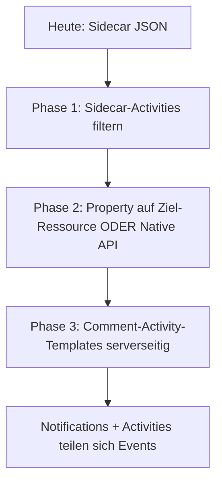

# Comments in Aktivitäten – Problem & Anregungen

Stand: Sidecar-MVP schreibt nach `.conflu/comments/{fileId}.json`. OpenCloud Activitylog protokolliert das als normale Datei-Operation.

## Was Nutzer heute sehen

```
Mathias Köppchen hat 4905b588-…_0de42f97-….json im comments aktualisiert
```

Das ist **technisch korrekt** (WebDAV PUT auf Sidecar), für Menschen **unbrauchbar**: UUID-Dateiname, Ordner „comments“, kein Bezug zur besprochenen Datei, bei jedem Tippen ein neuer Eintrag.

**Ursache:** Activitylog reagiert auf Storage-Events, nicht auf fachliche „Kommentar geschrieben“-Events. Die Graph Activities API ist **nur lesend** (`GET …/org.libregraph/activities`) – Extensions können dort keine eigenen Einträge anlegen.

Rückwärtskompatibilität ist **nicht nötig** (noch nicht produktiv) → Speicher und Activity-Quelle können geändert werden.

---

## Zielbild

Aktivitäten sollen ungefähr so aussehen:

| Aktion | Activity-Text (DE) |
|--------|-------------------|
| Neuer Kommentar | **Mathias Köppchen** hat in **Plan.md** kommentiert: „Bitte bis Freitag prüfen“ |
| Antwort | **Marie** hat auf einen Kommentar in **Plan.md** geantwortet |
| Erwähnung | **Mathias** hat **dich** in **Plan.md** erwähnt |
| Thread erledigt | **Marie** hat einen Kommentar-Thread in **Plan.md** erledigt |

Deep-Link: Datei/Ordner öffnen, Sidebar Comments, optional Thread fokussieren.

---

## Optionen (empfohlene Reihenfolge)

### 1. Sidecar-Aktivitäten ausblenden (schnell, Web oder Server)

**Idee:** Sidecar-Dateien weiter speichern, aber **nicht** in der globalen Aktivitäten-Liste anzeigen.

| Wo | Wie |
|----|-----|
| **Server (ideal)** | Activitylog filtert Pfade `**/.conflu/comments/**` (Feature/Config in OpenCloud – ggf. Issue an `opencloud-eu/opencloud`) |
| **Web-Extension** | Hook in der Activities-App: Einträge verwerfen, wenn `resource.path` oder `name` auf `.conflu/comments/` passt |

**Plus:** Kein Speicher-Umbau.  
**Minus:** Ohne Ersatz-Activity sieht man **gar keine** Kommentar-Aktivität (nur weniger Müll). Kombination mit Option 2 oder 3 nötig.

---

### 2. Speicher wechseln: WebDAV-Property auf der Ziel-Ressource (empfohlen für MVP+)

**Idee:** Kommentar-JSON nicht als separate Datei, sondern als **DAV-Property** an `Plan.md` / Ordner hängen, z. B.:

```text
Property: {http://opencloud.eu/extensions/comments/v1}document
Wert:     JSON (CommentDocument)
```

**Activity:** typisch „**Plan.md** aktualisiert“ – bereits lesbar, Bezug zur echten Ressource.

| Vorteil | Nachteil |
|---------|----------|
| Kein Müll in Aktivitäten-Ordner „comments“ | Property-Größenlimit beachten (große Threads → ggf. truncaten/archivieren) |
| Tag-Suche / Dashboard muss angepasst werden (nicht mehr Sidecar-Datei taggen) | |
| Ein PUT pro Speichern, weniger Datei-Noise als Sidecar-Ordner | Activity bleibt generisch „Datei geändert“, kein Kommentar-Preview |

**Zusatz:** Beim Speichern optional **kein** Activity auf Property-Only-Update – nur möglich, wenn Reva/OC einen Header oder Property-Change-Typ unterscheidet (Server-Thema). Sonst reicht lesbarer Dateiname aus Option 2b.

**2b – Sidecar bleibt, aber am Ziel:** `.Plan.md.conflu.json` **im selben Ordner** wie die Datei (nicht unter `.conflu/comments/`). Activity: „Plan.md.conflu.json in Projects aktualisiert“ – immer noch besser als UUID in „comments“.

---

### 3. Eigene Comment-Activities serverseitig (Zielbild)

**Idee:** Native Comments API (siehe `native-comments-api.md`) schreibt beim Speichern ein **Activity-Event auf die Ziel-Ressource**, nicht auf Sidecar-Pfade:

```json
{
  "template": {
    "message": "{user} commented on {resource}",
    "variables": {
      "user": { "id": "…", "displayName": "Mathias Köppchen" },
      "resource": { "id": "…", "name": "Plan.md" },
      "preview": "Bitte bis Freitag prüfen"
    }
  }
}
```

Sidecar/WebDAV-Storage wird abgeschaltet oder intern ohne Activity-Propagation genutzt.

| Vorteil | Nachteil |
|---------|----------|
| Korrekte Texte, Erwähnungen, Aggregation | Server-Entwicklung |
| Gleiches Event-Modell wie `notifications-plan.md` | |

Activity-Typen analog Notifications:

- `comment.created`, `comment.replied`, `comment.mention`, `comment.resolved`

**Aggregation:** Mehrere Saves innerhalb von `ACTIVITYLOG_WRITE_BUFFER_DURATION` (10 s) → ein Eintrag „3 Kommentare in Plan.md“.

---

### 4. Nur kosmetisch: lesbare Sidecar-Dateinamen

Minimal-Change ohne Server:

```text
.conflu/comments/Plan.md--a132d536.json
```

statt `{volle-fileId}.json`.

**Activity:** „Plan.md--a132d536.json im comments aktualisiert“ – **marginal besser**, Ordner „comments“ und „aktualisiert“ bleiben irreführend. Nur als Übergang, nicht als Lösung.

---

## Empfehlung für uns



1. **Kurzfristig:** Activities-Filter für `/.conflu/comments/` (Web-Hook oder Server-Filter) – Menü sofort entlasten.  
2. **Dann:** Speicher auf **WebDAV-Property an der Ziel-Datei** umstellen (Breaking Change ok). Dashboard-Suche über Tags/Property statt Sidecar-Datei-Search.  
3. **Parallel planen:** Native API + Activity-Templates mit Preview und Erwähnungs-Hinweis – deckt sich mit `notifications-plan.md`.

---

## Konkret im Code (web-app-comments)

| Heute | Anpassung |
|-------|-----------|
| `getCommentDocumentPath()` → `.conflu/comments/{fileId}.json` | Property-Adapter oder Sidecar-Pfad am Ziel |
| `syncCommentedTag()` taggt Sidecar-Ressource | Tag auf **Ziel-Ressource** (Graph), nicht Sidecar |
| Dashboard WebDAV-Search nach Sidecar-Dateien | Search/Index über getaggte Ziel-Ressourcen oder Server-Query |
| Kein Activity-Hook | Filter-Extension oder wegfallende Sidecar-Events |

---

## Offene Fragen an OpenCloud

1. Kann Activitylog Pfade/Patterns **global ignorieren** (`.conflu/**`)?
2. Lassen sich **PROPPATCH**-Updates ohne Activity oder mit gedämpftem Activity-Typ schreiben?
3. Gibt es einen **Extension Point** in der Web-Activities-App zum Filtern/Umschreiben?
4. Dürfen Services **Custom Activity Templates** registrieren (i18n `{user} commented on {resource}`)?

---

## Bezug Benachrichtigungen

Activities = **öffentliche Chronik** („was passiert ist im Space“).  
Notifications = **persönlicher Ping** („du wurdest erwähnt“).

Beide sollten dieselben fachlichen Events nutzen; Sidecar-Datei-Activities sind für beides ungeeignet.
