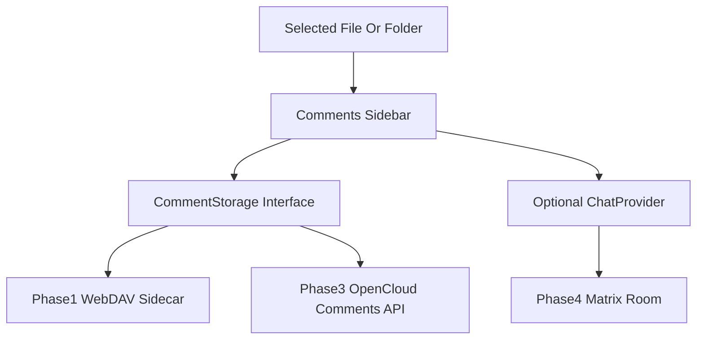

# Document Discussion Framework Plan

## Recommendation

Start with a new `web-app-comments` extension that adds a `global.files.sidebar` panel, modeled after `packages/web-app-maps/src/index.ts`. Keep comments storage behind a small adapter interface so the first version can use OpenCloud/WebDAV sidecar files for Conflu/docs prototypes, while later versions can swap in a native OpenCloud comments API or Matrix-backed chat.

## Existing Patterns To Reuse

The Maps app already shows how to register a sidebar panel:

```ts
{
  id: 'com.github.opencloud-eu.maps.sidebar-panel',
  type: 'sidebarPanel',
  extensionPointIds: ['global.files.sidebar'],
  panel: {
    name: 'location-details',
    icon: 'map-2',
    title: () => $gettext('Location'),
    component: LocationPanel,
    componentAttrs: (panelContext) => ({ panelContext }),
    isRoot: () => true,
    isVisible: ({ items }) => items?.length > 0
  }
}
```

The Notes app already provides a Markdown editing/rendering direction via OpenCloud's editor integration:

```ts
const textEditor = useTextEditor({
  contentType: 'markdown',
  modelValue: documentContent,
  readonly: isReadOnly,
  onUpdate: setDocumentContent
})
```

## Framework Findings

- `SVAR Vue Comments`: useful for a fast Vue 3 threaded-comment prototype with Markdown rendering, edit/delete events, readonly mode, localization, and themes. Because it is new and not an OpenCloud design-system component, treat it as prototype/inspiration unless dependency review accepts it.
- Custom OpenCloud Vue components: best for a production MVP because this repo prefers minimal dependencies and OpenCloud UI consistency. Implement threads, replies, resolve/delete, and Markdown/plain-text rendering directly.
- ownCloud/Nextcloud-style WebDAV comments API: strongest backend model for long-term native comments. It supports listing, creating, updating, deleting comments via endpoints like `/remote.php/dav/comments/files/{fileId}` and maps well to OpenCloud file/folder comments, unread counts, and notifications.
- Matrix/Element with `matrix-js-sdk`: good for rich chat, presence, history, and federated rooms per document. It needs a backend broker to create rooms, sync membership with OpenCloud permissions, and avoid insecure public-room iframe embedding.
- PouchDB/CouchDB: good offline sync technology, but not a good first OpenCloud integration because CouchDB has weak per-document ACL fit. It would need separate authentication, permission mirroring, and likely one-db-per-user or a proxy service.
- Yjs/Hocuspocus/Tiptap: good future path for real-time collaborative editing and inline comments. Hocuspocus needs a WebSocket backend. Official Tiptap Comments is proprietary; open-source inline comment extensions exist but are better for Conflu Markdown pages than generic files/folders.
- VitePress/Astro/Frontmatter tooling: useful inspiration for Conflu conventions such as `README.md`, YAML front matter, and generated sidebars. Do not embed VitePress as the runtime renderer; OpenCloud reads docs from WebDAV at runtime, not a build-time filesystem.

## Phase 1: Lightweight Comments Sidebar

- Add `packages/web-app-comments/` with an `index.ts` that registers a sidebar panel for selected files/folders.
- Implement `CommentsPanel.vue` with thread list, reply composer, edit/delete for own comments, resolve/unresolve, empty/loading/error states, and `$gettext` strings.
- Add `types.ts` and a `CommentStorage` interface with methods such as `list(target)`, `createThread(target, input)`, `replyToThread(target, threadId, input)`, `updateComment(target, threadId, commentId, patch)`, `deleteComment(target, threadId, commentId, actor)`, and `setThreadResolved(target, threadId, resolved, actor)`.
- Implement a WebDAV sidecar adapter for Conflu/docs prototypes. Prefer storing discussion files next to the target resource, for example `.{targetFileName}.jsco`, because generic file-level permission inheritance cannot be solved perfectly from a frontend-only extension.
- Use existing OpenCloud SSE only as a best-effort refresh trigger when the sidecar file changes. Do not promise true realtime yet.

## Phase 2: Conflu Integration

- Align with issue 131 by supporting documentation trees based on `README.md` or Markdown front matter rather than requiring a special `.rocc` file first.
- Show discussions as a page-level sidebar inside Conflu pages, and optionally expose a count badge in the file sidebar.
- Keep comments separate from Markdown content for normal page discussions. Only use inline editor comments later if the editor/comment framework is chosen explicitly.

## Phase 3: Native Backend Comments

- Define an OpenCloud comments API modeled after ownCloud/Nextcloud comments endpoints, backed by OpenCloud server storage/meta DB and enforcing file/folder permissions server-side.
- Add notification hooks for replies and mentions through OpenCloud notifications, plus unread/read markers.
- Swap the frontend storage adapter from WebDAV sidecar to the native API without replacing `CommentsPanel.vue`.

## Phase 4: Rich Chat Option

- Add a `MatrixStorage` or `ChatProvider` adapter only when a Matrix homeserver and OpenCloud-to-Matrix identity/permission bridge exist.
- Use one room per document/topic for live chat. The server bridge should create rooms, invite/remove users based on OpenCloud access, and store the room id against the target resource.
- Keep this separate from comments: comments are reviewable/resolvable document context; Matrix is live discussion.



## Key Risks

- A frontend-only sidecar store cannot perfectly inherit permissions for arbitrary individually shared files. Treat it as an MVP for Conflu/docs trees, not the final generic file-comment architecture.
- Notifications, unread markers, mentions, moderation, and reliable realtime updates need backend support.
- PouchDB/CouchDB adds a second security and identity model; avoid it unless offline-first comments become a hard requirement.
- Matrix is powerful but operationally heavier than comments and should be optional, not the foundation of the first version.

## Current Implementation Status

- `packages/web-app-comments/src/index.ts` registers the comments sidebar panel.
- `packages/web-app-comments/src/types.ts` defines the shared comment/thread/storage types.
- `packages/web-app-comments/src/storage/WebdavSidecarCommentStorage.ts` implements the WebDAV sidecar MVP.
- `packages/web-app-comments/src/components/CommentsPanel.vue` provides the sidebar UI.
- `packages/web-app-comments/docs/native-comments-api.md` drafts the native backend API contract.
