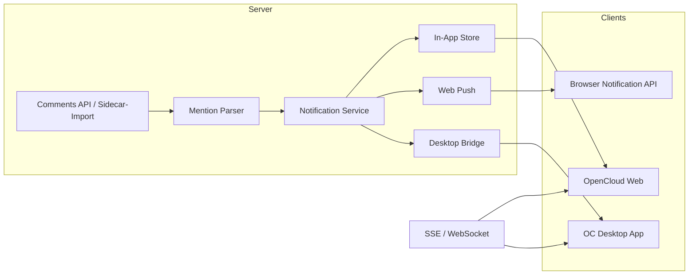

# Benachrichtigungen für Comments – Anregungen

Stand: Sidecar-MVP mit @‑Erwähnungen; siehe auch [individual-file-shares-and-notifications.md](./individual-file-shares-and-notifications.md) für Grenzen bei **einzeln freigegebenen Dateien** (Sidecar-Rechte, Dashboard, Toasts vs. Glocke).

Ziel: Nutzer sollen **zeitnah** erfahren, wenn etwas sie betrifft – nicht nur beim Öffnen des Dashboards. Erwähnungen sind dabei **eigene Trigger** neben Antworten, neuen Threads usw.

---

## Grundsatz

Benachrichtigungen sollten **ereignisgetrieben** sein, **kanalübergreifend** ankommen und **pro Nutzer konfigurierbar** bleiben. Die Web-Extension allein reicht dafür nicht zuverlässig: Sidecar-Dateien liefern kein zentrales „Wer darf was erfahren?“. Langfristig muss der **OpenCloud-Server** (oder ein Notifications-Service) Events erzeugen und an Clients pushen.

Kurzfristig können trotzdem **Client-seitige Bausteine** vorbereitet werden (In-App, Browser API), solange klar ist, dass sie **best effort** sind.

---

## Trigger (Ereignistypen)

Jeder Trigger sollte ein **eigenes Event** mit stabiler `type`-Kennung sein. Empfehlung:

| Trigger | Wann | Typische Empfänger | Priorität |
|--------|------|-------------------|-----------|
| `mention.created` | Jemand erwähnt `@Nutzer` in einem Kommentar | Genannt erwähnte Nutzer (aus `user:id`) | Hoch |
| `comment.reply` | Antwort auf einen Thread, in dem der Nutzer schon beteiligt war | Autor des übergeordneten Kommentars + ggf. Thread-Starter | Hoch |
| `thread.created` | Neuer Top-Level-Kommentar auf Ressource | Space-/Ordner-Verantwortliche, Datei-Besitzer, explizit abonnierte Nutzer | Mittel |
| `thread.resolved` | Thread wurde erledigt | Alle aktiven Teilnehmer des Threads | Niedrig |
| `thread.reopened` | Thread wieder geöffnet | Wie `thread.resolved` | Niedrig |
| `comment.edited` | Kommentar geändert (optional) | Erwähnte + Thread-Teilnehmer, wenn Inhalt/Erwähnungen sich ändern | Niedrig |
| `digest.unread` | Zusammenfassung ungelesener Aktivität | Nutzer mit aktivem Dashboard-Filter **Ich**, die länger offline waren | Niedrig (geplant) |

### Erwähnungen besonders

- **Nur strukturierte Erwähnungen** zählen verlässlich: `@[Anzeigename](user:id)` (bereits im Composer).
- Freitext wie `@marie` ohne Auswahl aus der Liste **nicht** als Notification-Trigger behandeln (Dashboard-Filter kann das optional tolerieren, Push nicht).
- Mehrere Erwähnungen in einem Kommentar → **ein Event pro erwähntem Nutzer**, nicht ein Sammel-Push pro Kommentar.
- **Self-mention** (`@ich selbst`) unterdrücken.
- Erwähnung in **bearbeitetem** Kommentar: nur **neu hinzugekommene** Erwähnungen benachrichtigen, nicht erneut alle alten.

### Wer ist „beteiligt“?

Für `comment.reply` und Resolve-Events sinnvolle Definition:

- Thread-Starter (erster nicht gelöschter Kommentar)
- Autoren aller nicht gelöschten Kommentare im Thread
- Alle in Erwähnungen referenzierten Nutzer
- **Nicht** der Auslöser (Actor) selbst

---

## Zielkanäle (Delivery)

Ein Event kann an **mehrere Kanäle** parallel gehen. Nutzer wählt pro Trigger, was aktiv ist.

### 1. In-App (OpenCloud Web)

- **Bell / Notification Center** (sofern OC das anbietet) – bevorzugter Kanal, wenn Server-Notifications existieren.
- Bis dahin: **Badge am Comments-Menüpunkt** + Hinweis im Dashboard („3 neue Threads für dich“).
- Klick auf Notification → Deep-Link zur Datei/Ordner/Space + Sidebar Comments geöffnet, Thread fokussiert.

Vorteil: keine Extra-Berechtigung, gleiche Session, Berechtigungen bereits geklärt.

### 2. Browser – Notification API

- [`Notification API`](https://developer.mozilla.org/en-US/docs/Web/API/Notifications_API) im Tab, der OpenCloud offen hat.
- Voraussetzung: explizite Nutzer-Erlaubnis (`Notification.requestPermission()`), am besten **kontextuell** (z. B. nach erster @‑Erwähnung oder in Einstellungen).
- Nur sinnvoll, wenn Tab im Hintergrund oder minimiert – sonst störend.
- **Service Worker** optional für Push ohne offenen Tab; erfordert serverseitiges Web Push (VAPID, Backend) – eher Phase 2.

Empfehlung MVP:

```text
SSE comment.sidecar.touched / später comment.created
  → Client prüft: betrifft mich? (Autor, Mention, Reply)
  → Wenn Tab hidden + Permission granted → Browser-Notification
  → Klick → focus window + navigate to target
```

Einschränkung Sidecar-MVP: SSE meldet Datei-Änderung, **nicht** wer was geschrieben hat → Client muss Sidecar neu laden und Diff gegen letzten Stand machen (fragil, aber machbar als Übergang).

### 3. OpenCloud Desktop App

- Idealer **langfristiger Kanal** für „echte“ Desktop-Benachrichtigungen (Windows/macOS/Linux Toast), auch wenn Browser zu ist.
- Desktop-App müsste dieselbe **Notification-API / SSE / WebSocket** wie Web nutzen oder einen **nativen Push** vom Server empfangen.
- Deep-Link-Schema z. B. `opencloud://files/{spaceId}?path=…&panel=comments&thread=…` – analog zu bestehenden OC-Desktop-Links prüfen.
- Erwähnungen und Antworten sollten **dieselben Event-Typen** wie Web tragen; nur das Rendering ist nativ.

### 4. E-Mail / Matrix (optional, später)

- E-Mail nur für Digest oder „wichtig + offline > 24h“, nicht für jede Antwort (sonst Spam).
- Matrix aus `document-discussion-framework-plan.md` bleibt **Chat**, nicht Ersatz für Comment-Notifications – kann aber parallel existieren.

---

## Architektur-Skizze



**Sidecar-Übergang:** Extension erkennt Änderung per SSE → lädt Sidecar → erzeugt **lokal** Client-Events → optional Browser-Toast. Kein zentraler Audit, keine Garantie bei mehreren Clients gleichzeitig.

**Zielbild:** Server parst Erwähnungen beim Speichern, schreibt Notification-Records, Clients abonnieren nur „ihre“ Events.

---

## Nutzer-Einstellungen (Vorschlag)

Pro Trigger und Kanal, z. B.:

| Einstellung | Default |
|-------------|---------|
| Erwähnung (@) – In-App | An |
| Erwähnung (@) – Browser | Aus (nach Opt-in) |
| Erwähnung (@) – Desktop | An (wenn App installiert) |
| Antwort auf meinen Thread – In-App | An |
| Neuer Kommentar auf Dateien in Space X | Aus |
| Digest täglich | Aus |

„**Ich**“ im Dashboard ist die **Anzeige-Filter**-Sicht; Notifications sind die **proaktive** Variante desselben Beteiligungsmodells.

---

## Payload (Event-Entwurf)

Einheitlich für Web, Browser und Desktop:

```json
{
  "id": "notif-uuid",
  "type": "mention.created",
  "createdAt": "2026-07-01T12:00:00Z",
  "actor": { "id": "einstein", "displayName": "Albert Einstein" },
  "target": {
    "resourceId": "space!file-1",
    "name": "Plan.md",
    "path": "/projects/plan.md",
    "spaceId": "space-1",
    "spaceName": "Marketing"
  },
  "threadId": "thread:abc",
  "commentId": "comment:xyz",
  "preview": "Bitte bis Freitag prüfen",
  "deepLink": "/files/spaces/marketing?file=…&comments=thread:abc"
}
```

- **`preview`**: gekürzt, **ohne** Markdown; bei fehlender Leserecht auf Ziel weglassen oder generisch („Neuer Kommentar auf Plan.md“).
- Browser-Notification: `title = "{actor} hat dich in {target.name} erwähnt"`, `body = preview`.

---

## Phasen

### Phase A – Client-only (Sidecar, jetzt)

- SSE `FILE_TOUCHED` auf Sidecar → Diff → lokale Queue „Neu für mich“
- Optional Browser-Notifications mit Permission
- Dashboard-Badge / Zähler für ungelesene „Ich“-Threads
- **Kein** Versprechen bei geteilten Sidecars und Race Conditions

### Phase B – Server-Notifications (native API)

- Beim `POST`/`PATCH` Kommentar: Mention-Parser serverseitig
- Persistente Notifications + read/unread
- SSE/WebSocket: `notification.created`, `comment.*`
- Web nutzt OC Notification Center; Browser/Desktop als Subscriber

### Phase C – Desktop & Push

- Desktop-App subscribed auf gleiche Events
- Optional Web Push für Browser ohne offenen Tab

---

## Offene Punkte

1. **Berechtigung:** Notification nur, wenn Empfänger **Leserecht** auf Ziel-Ressource hat (Server muss prüfen).
2. **Gruppen-Erwähnungen:** `@team` später – eigener Trigger `mention.group`?
3. **Ruhezeiten / Do Not Disturb:** global OC-Setting oder pro App?
4. **Aggregation:** fünf Erwähnungen in einer Minute → ein Toast „5 neue Erwähnungen“?
5. **Desktop:** existiert bereits ein OC-Notification-Bus, an den Extensions andocken können?

---

## Bezug zum bestehenden Code

| Heute | Rolle für Notifications |
|-------|-------------------------|
| `@[Name](user:id)` in `utils/mentions.ts` | stabile Empfänger-ID für `mention.created` |
| Dashboard-Filter **Ich** + `threadInvolvesUser()` | gleiche Logik für „betrifft mich“ |
| SSE in `useComments.ts` | Ausgangspunkt für Phase A (Sidecar refresh) |
| `docs/native-comments-api.md` | Server-Trigger und Notification-Hooks bereits skizziert |

Nächster sinnvoller Schritt nach dem MVP: **Unread-Marker pro Thread** im Sidecar oder Server, dann Browser-Notifications nur für echte Ungelesen-Änderungen – nicht für jedes SSE-Flackern.
